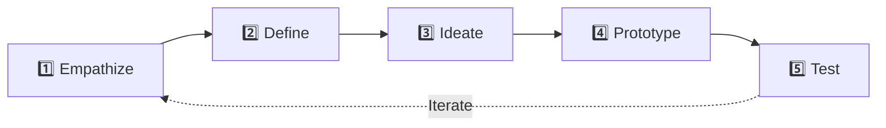

# Design Thinking for Agentic Workflow Automation

[Back to Home](../README.md)

This section applies a rigorous **Design Thinking** methodology to each production workflow in this repository. Rather than jumping straight to tools and code, we walk through every workflow using the five canonical Design Thinking phases:

---

## Why Design Thinking for Automation?

Most workflow automation projects fail not because the tool was wrong, but because the **problem was never properly understood**. Teams jump into Zapier or n8n without asking:

- *Who* is the actual end-user of this automation?
- *What* is the pain they feel, in their own words?
- *Where* does value actually break down in the current process?
- *How* will we know the automation is working — not just running?

Design Thinking forces these questions to the surface **before** a single node is wired.

| Without Design Thinking | With Design Thinking |
| :--- | :--- |
| "Let's connect Typeform to Slack" | "Sales reps waste 40 min/day manually qualifying leads — how can we give them back that time?" |
| "Let's add AI to our support tickets" | "Customers churn when first-response time exceeds 4 hours. What would a sub-60-second intelligent triage look like?" |
| "Let's use CrewAI for research" | "Analysts spend 3 days producing a single briefing. How do we compress that to 30 minutes without losing nuance?" |
| "Let's have AI write our code tests" | "Our PR cycle averages 48 hours because test coverage is manual. What if tests were generated and executed before a human even reviews?" |

---

## Workflow Deep-Dives

Each deep-dive follows a consistent structure:

| Phase | What We Produce |
| :--- | :--- |
| **Empathize** | User personas, journey maps, pain-point interviews, empathy maps |
| **Define** | Problem statements (POV), How Might We (HMW) questions, success metrics |
| **Ideate** | Solution brainstorming, competitive scan, architecture candidates, prioritization matrices |
| **Prototype** | Low-fidelity workflow sketches, node-level configuration, prompt engineering, data flow schemas |
| **Test** | Test plan, acceptance criteria, failure mode analysis, iteration log |

### 1. [Lead Enrichment & Classification Pipeline](dt_lead_generation.md)
> **Stack:** Zapier · OpenAI GPT-4o · Google Sheets · Slack
>
> *Design challenge:* How might we transform raw form submissions into sales-ready intelligence before a rep even opens Slack?

### 2. [Intelligent Customer Support Router & Triage](dt_customer_support.md)
> **Stack:** n8n · Pinecone · Claude 3.5 Sonnet · Zendesk
>
> *Design challenge:* How might we get customers accurate, empathetic first-touch responses in under 60 seconds — without replacing human agents?

### 3. [Multi-Agent Research & Writing Crew](dt_multi_agent_research.md)
> **Stack:** CrewAI · Serper API · GPT-4o
>
> *Design challenge:* How might we let a team of AI agents replicate the rigor of a professional analyst team, from raw web data to publication-ready reports?

### 4. [Automated Testing Code Assistant](dt_code_generator.md)
> **Stack:** AutoGen · Python Executor
>
> *Design challenge:* How might we create a self-correcting code generation loop that produces fully-tested, production-grade Python functions from a natural language spec?

---

## Cross-Cutting Design Principles

These principles apply to **every** agentic workflow, regardless of tool:

### 🛡️ Principle 1: Human-in-the-Loop by Default
Never deploy an AI-only pipeline to production. Design explicit approval gates where a human reviews outputs before they reach customers, databases, or communication channels. The cost of one bad AI response far exceeds the cost of a 30-second human review.

### 🔄 Principle 2: Design for Feedback Loops
Every workflow should capture signals about its own quality. If a human edits an AI draft, that edit is training data. If a classified lead turns out to be mis-tiered, that's a correction signal. Build these loops into your design from day one.

### 📊 Principle 3: Instrument Everything
You cannot improve what you cannot measure. Every workflow should emit metrics: latency, token usage, error rate, human override rate, and downstream impact (e.g., did the enriched lead actually convert?).

### 🧱 Principle 4: Compose, Don't Monolith
Break workflows into small, independently testable stages. A monolithic 15-step Zapier Zap is fragile. A composition of 3 focused sub-workflows — each with its own error handling — is antifragile.

### 🔐 Principle 5: Secure by Design
LLMs should never see raw API keys, PII, or credentials. Use environment variables, OAuth delegation (Zapier handles this well), and data masking in prompts. In code-execution agents (AutoGen), always sandbox with Docker.

---

*Navigate to any deep-dive above to see the full Design Thinking applied to a real workflow.*
