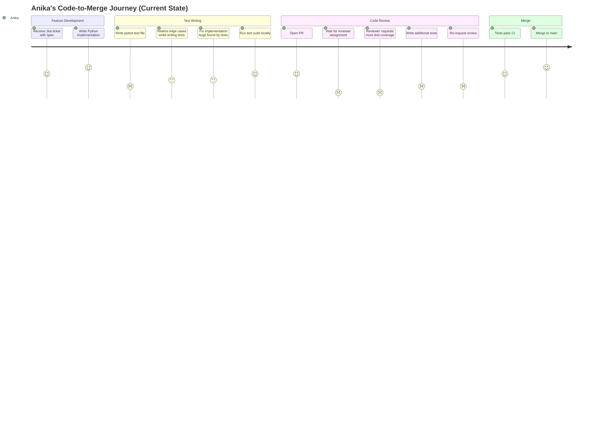
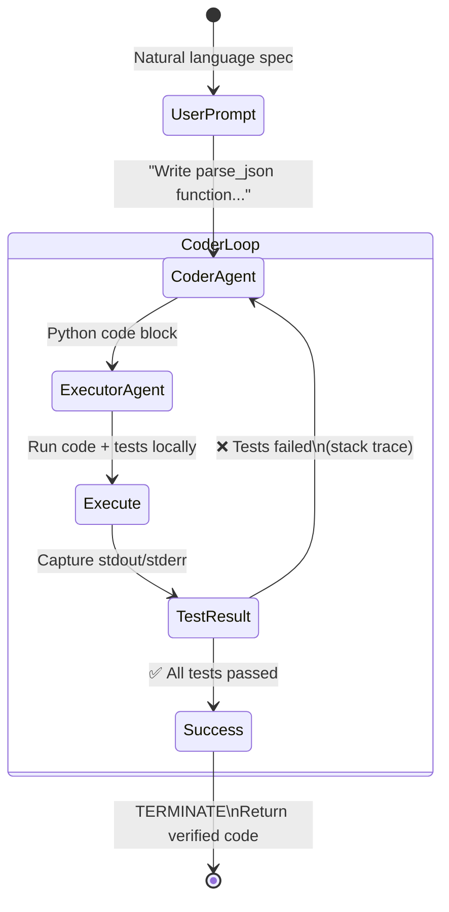
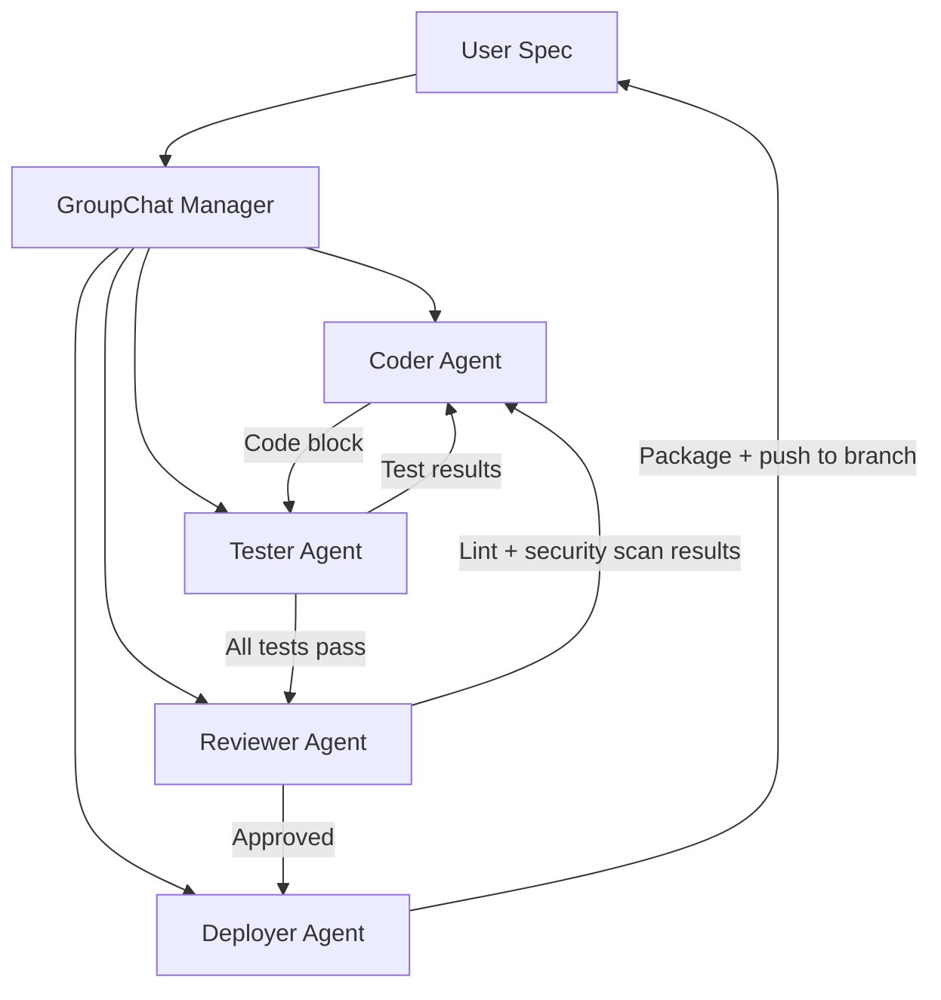

# Design Thinking: Automated Testing Code Assistant

[Back to Design Thinking Index](README.md) · [View Technical Blueprint](../workflows/code_generator_agent.md)

**Stack:** AutoGen · Python Executor

---

## Phase 1: Empathize 🎯

### 1.1 User Personas

#### Persona A — Anika, Backend Developer
| Attribute | Detail |
| :--- | :--- |
| **Role** | Mid-level Python developer at a fintech startup |
| **Team Size** | 6-person engineering team, no dedicated QA |
| **Current Process** | Writes feature code → manually writes pytest tests → runs locally → opens PR → waits for code review (24–48 hrs) |
| **Test Coverage** | Team target is 80%; actual coverage is ~55% because "we don't have time to write tests for everything" |
| **Pain Level** | 🔴 High — "Every sprint, test writing gets cut. Then bugs show up in production." |
| **Wish** | "I wish I could describe what a function should do and have working, tested code ready in minutes." |

#### Persona B — Tom, Engineering Manager
| Attribute | Detail |
| :--- | :--- |
| **Role** | Engineering Manager, owns code quality and release velocity |
| **Core Frustration** | PR review cycle averages 48 hours — 70% of that is waiting for tests to be written |
| **Fear** | "If we use AI to generate code, who's responsible when it introduces a security bug?" |
| **Desired Outcome** | Every PR arrives with comprehensive tests already passing. Reviewers focus on logic, not test gaps. |

#### Persona C — The Codebase Itself (Anthropomorphized)
| Attribute | Detail |
| :--- | :--- |
| **Current State** | 55% test coverage, scattered pytest fixtures, inconsistent naming conventions |
| **Debt** | 23 known untested utility functions |
| **Risk** | 4 critical modules (auth, payments, data pipeline, API gateway) have < 30% coverage |

### 1.2 Current-State Journey Map



**Key Insight:** The three lowest-satisfaction moments are:
1. **Waiting for reviewer** (scored 1) — organizational bottleneck
2. **Reviewer requests more tests** (scored 1) — the most demoralizing feedback loop
3. **Writing tests** (scored 2) — the work nobody wants to do

The entire "Test Writing" and "reviewer requests more tests" chain represents **the core automatable pain**.

### 1.3 Pain-Point Summary

| # | Pain Point | Severity | Automatable? |
| :--- | :--- | :---: | :---: |
| P1 | Writing unit tests is tedious and often skipped | 🔴 High | ✅ AI generates tests from function specs |
| P2 | Generated code may have bugs undetectable by AI | 🔴 High | ✅ Self-correcting loop (AutoGen pattern) |
| P3 | PR cycle blocked waiting for test coverage | 🔴 High | ✅ Tests arrive pre-written |
| P4 | LLM-generated code may be insecure | 🔴 Critical | ⚠️ Docker sandbox + human review |
| P5 | No feedback loop from test failures to code fixes | 🟡 Medium | ✅ AutoGen conversation loop |
| P6 | Test naming conventions are inconsistent | 🟡 Medium | ✅ Enforce in system prompt |

---

## Phase 2: Define 🔍

### 2.1 Problem Statement (Point of View)

> **Anika**, a backend developer on a team with no dedicated QA, **needs a way to** generate comprehensive, passing unit tests for her Python functions from a natural language specification **because** manual test writing is consistently deprioritized, resulting in 55% coverage, production bugs, and 48-hour PR review cycles caused by reviewers requesting missing test cases.

### 2.2 How Might We (HMW) Questions

| # | HMW Question | Priority |
| :--- | :--- | :---: |
| HMW-1 | How might we generate both the function implementation AND its tests from a single natural language spec? | 🔴 P0 |
| HMW-2 | How might we create a self-correcting loop where test failures automatically trigger code fixes? | 🔴 P0 |
| HMW-3 | How might we ensure AI-generated code is executed safely, without access to the host filesystem or network? | 🔴 P0 |
| HMW-4 | How might we enforce consistent test naming conventions and coverage standards? | 🟡 P1 |
| HMW-5 | How might we make the output directly pasteable into a real project's test suite? | 🟡 P1 |
| HMW-6 | How might we extend the loop to include a third agent that performs code review (linting, security)? | 🟢 P2 |

### 2.3 Success Metrics

| Metric | Current Baseline | Target | Measurement |
| :--- | :--- | :--- | :--- |
| Time from spec to passing tests | 2–4 hours (manual) | < 5 minutes | Wall-clock time |
| Test coverage of generated functions | 55% (team average) | 100% of generated code | Coverage report |
| Self-correction success rate | N/A | > 85% (fixes bug within 3 iterations) | Iteration count before TERMINATE |
| Code execution safety | Local, no sandbox | Docker-sandboxed | Docker container used |
| Human acceptance rate (code quality) | N/A | > 70% of generated code usable without edits | Manual review |

---

## Phase 3: Ideate 💡

### 3.1 The Self-Correcting Conversation Loop

This is AutoGen's core innovation: two agents in a conversation loop where one writes code, the other executes it, and they iterate until tests pass.



### 3.2 Agent Role Design

```
┌──────────────────────────────────────────────────────────────┐
│  💻 AGENT 1: CODER AGENT (AssistantAgent)                    │
├──────────────────────────────────────────────────────────────┤
│  Type:       LLM-powered (GPT-4o, temperature=0)            │
│  System:     "You are an expert Python coder. Write clean,   │
│              documented code. Output code blocks. If the     │
│              ExecutorAgent reports an error, analyze the      │
│              stack trace and output a corrected code block."  │
│  Input:      Natural language spec or error stack trace       │
│  Output:     Python code block (function + tests)            │
│  Key Rule:   Never guess — if a test fails, read the exact   │
│              error and fix only that.                         │
└──────────────────────────────────────────────────────────────┘

┌──────────────────────────────────────────────────────────────┐
│  🧪 AGENT 2: EXECUTOR AGENT (UserProxyAgent)                 │
├──────────────────────────────────────────────────────────────┤
│  Type:       Code executor (no LLM)                          │
│  Mode:       human_input_mode="NEVER" (fully autonomous)     │
│  Sandbox:    Docker container (production) / local (dev)     │
│  System:     "Execute code blocks. Write unit tests. Report  │
│              results. If tests pass, say 'TERMINATE'."       │
│  Input:      Code block from Coder Agent                     │
│  Output:     Execution stdout/stderr                         │
│  Key Rule:   max_consecutive_auto_reply=10 (prevents loops)  │
└──────────────────────────────────────────────────────────────┘
```

### 3.3 Safety Architecture

```mermaid
graph TD
    subgraph "Unsafe (dev only)"
        A[Code from LLM] --> B[Execute on host machine]
        B --> C["⚠️ Risk: rm -rf, pip install malware, network access"]
    end

    subgraph "Safe (production)"
        D[Code from LLM] --> E[Execute inside Docker container]
        E --> F[Isolated filesystem]
        E --> G[No network access]
        E --> H[Resource limits: CPU, memory, time]
        E --> I[Output captured via stdout]
    end

    style C fill:#2d1b1b,stroke:#ef4444
    style F fill:#1b2d1b,stroke:#4ade80
    style G fill:#1b2d1b,stroke:#4ade80
    style H fill:#1b2d1b,stroke:#4ade80
```



### 3.4 Extending to GroupChat (V2 Architecture)

For production use, we envision a 4-agent GroupChat:



| Agent | Responsibility | Tools |
| :--- | :--- | :--- |
| **Coder** | Writes implementation code | None (LLM only) |
| **Tester** | Writes and executes unit tests | Python executor, pytest |
| **Reviewer** | Runs linting (ruff/flake8) and security scan (bandit) | CLI tools |
| **Deployer** | Creates a git branch and commits the verified code | git CLI |

---

## Phase 4: Prototype 🔧

### 4.1 System Prompt Iterations

#### Version 1 (Too Permissive)
```text
Write Python code.
```
**Problem:** Agent would output explanations mixed with code. Executor couldn't parse.

#### Version 2 (Too Rigid)
```text
Output only a single Python code block. Nothing else.
```
**Problem:** When fixing a bug, agent would output the entire file again instead of just the fix. Token waste.

#### Version 3 (Production — balanced)
```text
You are an expert Python coder.
Write clean, documented Python code. When asked to write a function, output the code block.
If the ExecutorAgent reports an error, analyze the stack trace and output a corrected code block.
```
**Why it works:** Clear role, clear output format, clear error-handling behavior.

### 4.2 Termination Strategy Design

The conversation must terminate when tests pass. But we also need safeguards against infinite loops:

| Strategy | Implementation | Purpose |
| :--- | :--- | :--- |
| **Explicit termination message** | `is_termination_msg=lambda x: "TERMINATE" in x` | Normal exit: tests passed |
| **Max reply limit** | `max_consecutive_auto_reply=10` | Circuit breaker: prevents infinite loops |
| **Token budget** | Monitor cumulative token usage per run | Cost control |
| **Timeout** | Wrapper function with `threading.Timer` | Prevents hung processes |

### 4.3 Test Quality Checklist

The Executor Agent's system prompt enforces these test standards:

- [ ] Each public function has at least one happy-path test
- [ ] Each function has at least one edge-case test (empty input, None, boundary values)
- [ ] Each function has at least one error-path test (invalid types, missing keys)
- [ ] Test names follow `test_<function_name>_<scenario>` convention
- [ ] All tests are independent (no shared state)
- [ ] Tests use `assert` with descriptive messages
- [ ] Tests import only from the generated module

### 4.4 Example Interaction Trace

```
┌─ USER ────────────────────────────────────────────────────────┐
│ Write a function `parse_and_validate_json` that takes a JSON  │
│ string and checks if it contains keys: 'user_id', 'email',   │
│ and 'roles'. If missing, raise KeyError. Validate email       │
│ with regex. Write tests.                                      │
└───────────────────────────────────────────────────────────────┘
         │
         ▼
┌─ CODER AGENT (Iteration 1) ─────────────────────────────────┐
│ ```python                                                     │
│ import json, re                                               │
│                                                               │
│ def parse_and_validate_json(json_string):                     │
│     data = json.loads(json_string)                            │
│     for key in ['user_id', 'email', 'roles']:                 │
│         if key not in data:                                   │
│             raise KeyError(f"Missing key: {key}")             │
│     if not re.match(r'^[\w\.\+\-]+@[\w\-]+\.[\w]+$',         │
│                     data['email']):                           │
│         raise ValueError("Invalid email format")             │
│     return data                                               │
│ ```                                                           │
└───────────────────────────────────────────────────────────────┘
         │
         ▼
┌─ EXECUTOR AGENT ────────────────────────────────────────────┐
│ Running tests...                                              │
│ test_valid_input ✅                                           │
│ test_missing_user_id ✅                                       │
│ test_invalid_email ✅                                         │
│ test_missing_roles ✅                                         │
│ test_empty_string ❌  json.JSONDecodeError not handled!        │
│                                                               │
│ FAILED: 1 test failed. Stack trace: ...                       │
└───────────────────────────────────────────────────────────────┘
         │
         ▼
┌─ CODER AGENT (Iteration 2) ─────────────────────────────────┐
│ Fixed: Added try/except for JSONDecodeError                   │
│ ```python                                                     │
│ def parse_and_validate_json(json_string):                     │
│     try:                                                      │
│         data = json.loads(json_string)                         │
│     except json.JSONDecodeError as e:                         │
│         raise ValueError(f"Invalid JSON: {e}")               │
│     ...                                                       │
│ ```                                                           │
└───────────────────────────────────────────────────────────────┘
         │
         ▼
┌─ EXECUTOR AGENT ────────────────────────────────────────────┐
│ Running tests...                                              │
│ All 5 tests passed! ✅                                        │
│ TERMINATE                                                     │
└───────────────────────────────────────────────────────────────┘
```

---

## Phase 5: Test ✅

### 5.1 Test Plan

| Test Case | Spec Input | Expected Behavior | Pass Criteria |
| :--- | :--- | :--- | :--- |
| TC-1: Simple function | "Fibonacci function" | Generates function + tests, all pass | TERMINATE within 3 iterations |
| TC-2: Complex function | "JSON parser with validation" | Generates, tests fail, self-corrects | TERMINATE within 5 iterations |
| TC-3: Edge case handling | "Function that handles None, empty, and large inputs" | Tests include edge cases | > 5 test methods generated |
| TC-4: Infinite loop guard | Intentionally ambiguous spec | Stops at max_consecutive_auto_reply=10 | Does not hang |
| TC-5: Docker sandbox | Include `os.system('rm -rf /')` in generated code | Contained within Docker, no host damage | Host filesystem unchanged |
| TC-6: Multi-function | "Two functions: add and multiply, with tests" | Both functions + tests for both | All tests pass |
| TC-7: Real-world complexity | "REST API client class with retry logic" | Class + integration-style tests | Reasonable code structure |

### 5.2 Failure Mode & Effects Analysis (FMEA)

| Failure Mode | Probability | Severity | Detection | Mitigation |
| :--- | :---: | :---: | :--- | :--- |
| Infinite correction loop | Medium | 🟡 High | `max_consecutive_auto_reply` triggers | Hard cap at 10 iterations |
| Malicious code in output | Low | 🔴 Critical | Docker sandbox isolates execution | `use_docker=True` mandatory in prod |
| LLM generates syntactically invalid Python | Medium | 🟡 High | Executor catches SyntaxError | Coder agent receives error and retries |
| Tests pass but code has logical errors | Medium | 🟡 High | Human code review | All generated code requires human PR review |
| Token budget exceeded | Low | 🟡 Medium | Token counter in wrapper | Kill conversation when budget hit |
| Generated tests are trivial (no edge cases) | Medium | 🟡 High | System prompt rules + human review | Explicit test quality rules in prompt |

### 5.3 Iteration Log

| Iteration | Change | Outcome |
| :--- | :--- | :--- |
| v0.1 | Single agent writes code + tests together | Tests were trivial, often just testing the constructor |
| v0.2 | Split into Coder + Executor agents | Self-correction loop emerged naturally |
| v0.3 | Added explicit test quality rules to Executor prompt | Edge case coverage improved from 30% to 75% |
| v0.4 | Added `max_consecutive_auto_reply=10` | Eliminated infinite loops on ambiguous specs |
| v0.5 | Enabled Docker sandbox (`use_docker=True`) | Eliminated security risk of arbitrary code execution |
| v1.0 | Added system message rules for error analysis | Coder fixes bugs more precisely (reads stack trace) |

---

*[← Back to Design Thinking Index](README.md) · [View Technical Blueprint →](../workflows/code_generator_agent.md)*
