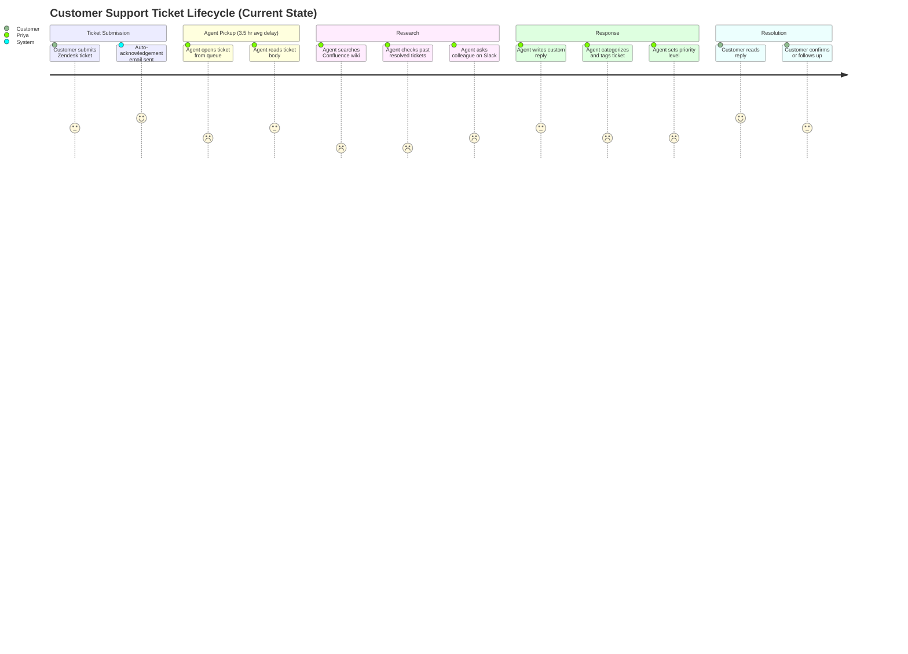
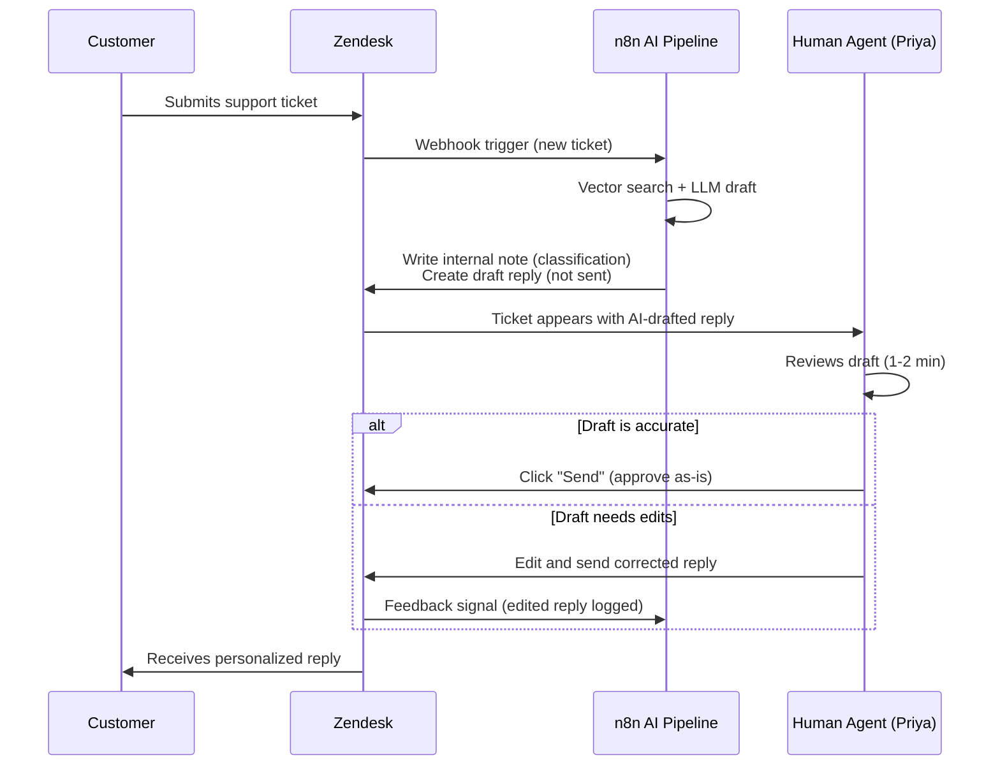
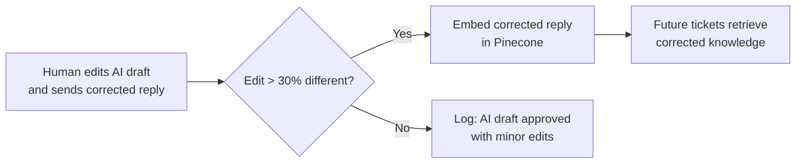

# Design Thinking: Intelligent Customer Support Router & Triage

[Back to Design Thinking Index](README.md) · [View Technical Blueprint](../workflows/customer_support_agent.md)

**Stack:** n8n · Pinecone · Claude 3.5 Sonnet · Zendesk

---

## Phase 1: Empathize 🎯

### 1.1 User Personas

#### Persona A — Priya, Tier-1 Support Agent
| Attribute | Detail |
| :--- | :--- |
| **Role** | Customer Support Agent, Tier-1 |
| **Company** | Mid-size SaaS platform (~15,000 active users) |
| **Daily Volume** | Handles 50–80 Zendesk tickets per shift |
| **Current Process** | Reads ticket, searches internal wiki (Confluence) for solutions, writes reply from scratch, tags category/urgency, escalates if needed |
| **Time per Ticket** | 6–10 minutes average (research + drafting) |
| **Pain Level** | 🔴 High — "I answer the same 20 questions all day. The wiki is outdated and hard to search." |
| **CSAT Impact** | First-response time averages 3.5 hours; SLA target is 1 hour |

#### Persona B — David, VP of Customer Success
| Attribute | Detail |
| :--- | :--- |
| **Role** | VP Customer Success |
| **Core Frustration** | Churn is correlated with first-response time. Every hour of delay increases churn probability by 8%. |
| **Desired Outcome** | Sub-60-second intelligent first-touch. Human agents handle complex cases; routine tickets are auto-drafted. |
| **Risk Concern** | "If AI gives a wrong answer to a customer, we lose trust faster than if we were slow." |

#### Persona C — End Customer (Ticket Submitter)
| Attribute | Detail |
| :--- | :--- |
| **Context** | Frustrated user who just hit a bug or billing issue |
| **Expectation** | Wants acknowledgment immediately. Wants the *right* answer, not a template. |
| **Worst Experience** | Getting a clearly-canned "Thank you for contacting us" response that doesn't address their issue |

### 1.2 Current-State Journey Map



**Key Insights:**
- The 3.5-hour gap between submission and agent pickup is the #1 churn driver.
- Wiki search (scored 1) is the lowest-satisfaction agent task — the wiki is outdated, poorly indexed, and doesn't surface past ticket resolutions.
- Categorization is subjective and inconsistent (just like lead classification in Workflow 1).

### 1.3 Empathy Map — Priya (Tier-1 Agent)

```
                    ┌──────────────────────────────────────┐
                    │          PRIYA (Tier-1 Agent)         │
        ┌───────────┼──────────────────────────────────────┼───────────┐
        │   THINKS  │                                      │   FEELS   │
        │           │  "I've answered this exact            │           │
        │  "Why     │   question 12 times this week"       │ Burned    │
        │   can't   │                                      │ out by    │
        │   the     │  "If I categorize this wrong,        │ repetitive│
        │   wiki    │   it goes to the wrong team"         │ work      │
        │   just    │                                      │           │
        │   work?"  │                                      │ Anxious   │
        │           │                                      │ about SLA │
        ├───────────┼──────────────────────────────────────┼───────────┤
        │   SAYS    │                                      │   DOES    │
        │           │  "I need a smarter search             │           │
        │  "Give    │   that finds resolved tickets,       │  Alt-tabs │
        │   me a    │   not just wiki stubs"               │  between  │
        │   draft   │                                      │  Zendesk, │
        │   to      │  "I'm fine editing AI drafts —       │  wiki,    │
        │   start   │   just don't send them without me"   │  Slack    │
        │   from"   │                                      │           │
        └───────────┴──────────────────────────────────────┴───────────┘
```

### 1.4 Pain-Point Summary

| # | Pain Point | Severity | Who Feels It | Automatable? |
| :--- | :--- | :---: | :--- | :---: |
| P1 | 3.5-hour average first-response time | 🔴 Critical | Customer, David | ✅ AI-generated instant draft |
| P2 | Wiki search returns irrelevant results | 🔴 High | Priya | ✅ Vector DB semantic search |
| P3 | Past resolved tickets aren't searchable | 🔴 High | Priya | ✅ Embed resolved transcripts in Pinecone |
| P4 | Inconsistent ticket categorization | 🟡 Medium | David, downstream teams | ✅ LLM classification |
| P5 | Agent burnout from repetitive tickets | 🟡 Medium | Priya | ✅ Auto-draft routine answers |
| P6 | Risk of AI sending wrong answer | 🔴 Critical | David, Customer | ⚠️ Mitigated by HITL design |

---

## Phase 2: Define 🔍

### 2.1 Problem Statement (Point of View)

> **Priya**, a Tier-1 support agent handling 50–80 tickets per day, **needs a way to** instantly receive an accurate, context-aware draft reply — along with an auto-classification and urgency score — the moment a ticket arrives, **because** her current process of manually searching a poorly-indexed wiki and writing replies from scratch results in a 3.5-hour average first-response time, directly correlating with customer churn.

### 2.2 How Might We (HMW) Questions

| # | HMW Question | Priority |
| :--- | :--- | :---: |
| HMW-1 | How might we generate a relevant, accurate draft reply within 30 seconds of ticket creation? | 🔴 P0 |
| HMW-2 | How might we replace keyword-based wiki search with semantic, context-aware retrieval? | 🔴 P0 |
| HMW-3 | How might we classify ticket category and urgency deterministically, without agent subjectivity? | 🟡 P1 |
| HMW-4 | How might we ensure AI never sends a customer-facing response without human review? | 🔴 P0 |
| HMW-5 | How might we create a continuous learning loop where human edits improve future AI drafts? | 🟡 P1 |
| HMW-6 | How might we alert the support lead in real-time when a high-urgency ticket arrives? | 🟢 P2 |

### 2.3 Success Metrics

| Metric | Current Baseline | Target | Measurement |
| :--- | :--- | :--- | :--- |
| First-response time | 3.5 hours | < 1 minute (AI draft) + < 15 min (human review) | Zendesk reporting timestamps |
| Agent time per ticket | 6–10 minutes | 1–2 minutes (review + approve/edit AI draft) | Time-tracking integration |
| Categorization accuracy | ~70% (human, inconsistent) | > 95% | Audit: compare AI category vs. resolution category |
| Customer satisfaction (CSAT) | 72% | > 88% | Post-resolution survey |
| AI draft acceptance rate (no edits) | N/A | > 60% | Track: AI draft sent vs. human-edited draft sent |
| Knowledge base coverage | ~40% of ticket types have wiki articles | > 85% (via embedded resolved tickets) | Pinecone index coverage audit |

---

## Phase 3: Ideate 💡

### 3.1 Solution Architecture Candidates

| # | Architecture | Pros | Cons | Verdict |
| :--- | :--- | :--- | :--- | :---: |
| S1 | **n8n + Pinecone + Claude** (chosen) | Self-hostable, free tier, native AI nodes, vector semantic search | Requires Docker setup, no built-in analytics | ✅ Selected |
| S2 | Zapier + OpenAI + Zendesk | Fastest setup, managed hosting | No vector DB integration, limited branching | ❌ Insufficient |
| S3 | LangChain Python script + cron | Full control, cheapest | No visual monitoring, fragile, no webhook trigger | ❌ |
| S4 | Flowise + Qdrant | Visual RAG builder | Less mature ecosystem, fewer Zendesk integrations | ❌ |

### 3.2 RAG (Retrieval-Augmented Generation) Design

The core innovation is replacing the wiki with a **vector database** containing embedded resolved support transcripts.

```mermaid
graph TD
    subgraph "Offline: Knowledge Ingestion Pipeline"
        KS[Knowledge Sources] --> SP[Text Splitter]
        KS2[Resolved Zendesk Tickets] --> SP
        SP --> EMB[OpenAI Embedding Model<br/>text-embedding-3-small]
        EMB --> PC[Pinecone Vector Store<br/>Namespace: support-kb]
    end

    subgraph "Online: Ticket Processing Pipeline"
        T[New Zendesk Ticket] --> Q[Ticket Body as Query]
        Q --> EMB2[Embed Query]
        EMB2 --> PCQ[Pinecone Similarity Search<br/>Top-K: 3]
        PCQ --> CTX[Retrieved Context Documents]
        CTX --> LLM[Claude 3.5 Sonnet<br/>with System Prompt]
        T --> LLM
        LLM --> OUT["JSON: { suggested_reply, category, urgency }"]
    end

    style KS fill:#1a1a2e,stroke:#6366f1
    style KS2 fill:#1a1a2e,stroke:#6366f1
    style PC fill:#1e293b,stroke:#06b6d4
    style PCQ fill:#1e293b,stroke:#06b6d4
    style LLM fill:#1e293b,stroke:#8b5cf6
```



### 3.3 Human-in-the-Loop (HITL) Design

This is the **most critical design decision**. The AI must never directly reply to a customer.



### 3.4 Feedback Loop Architecture

When a human significantly edits an AI draft, the corrected response becomes training data for the vector database:



---

## Phase 4: Prototype 🔧

### 4.1 System Prompt Engineering

#### Version 1 (Naive)
```text
You are a support agent. Reply to this ticket.
```
**Problem:** Generic responses. No use of retrieved context. No structured output.

#### Version 2 (Context-Aware but Unstructured)
```text
You are a support agent. Here is relevant documentation: {{context}}. Reply to this ticket: {{ticket_body}}.
```
**Problem:** Produced natural language replies but no classification or urgency score.

#### Version 3 (Production — selected)
```text
You are an expert customer support agent for a SaaS product.
Analyze the incoming support ticket. Use the retrieved documentation below to construct an accurate, empathetic, and helpful answer.

Retrieved Knowledge:
{{pinecone_documents}}

Incoming Ticket:
Subject: {{ticket_subject}}
Body: {{ticket_body}}

Rules:
1. If the documentation contains a direct answer, use it verbatim with minor personalization.
2. If the documentation is partially relevant, synthesize an answer and clearly state what you're confident about vs. what may need escalation.
3. Never fabricate product features, pricing, or technical specs.
4. Match the customer's tone — frustrated customers get empathetic openings, factual customers get concise answers.

Format your output strictly as JSON:
{
  "suggested_reply": "Dear [Customer Name]...",
  "category": "Billing | Technical | Feature Request | Account | Other",
  "urgency": "High | Medium | Low",
  "confidence": "High | Medium | Low",
  "escalation_needed": true/false,
  "reasoning": "Brief explanation of why you chose this category and urgency"
}
```

### 4.2 Confidence-Based Routing

The `confidence` field enables a second layer of intelligent routing:

| AI Confidence | Urgency | Action |
| :---: | :---: | :--- |
| High | Low/Medium | Draft appears in Priya's queue for quick review |
| High | High | Draft appears + Slack alert to Support Lead |
| Medium | Any | Draft appears with ⚠️ flag: "AI is uncertain — review carefully" |
| Low | Any | No draft shown. Ticket routed directly to Tier-2 with reasoning note |

### 4.3 n8n Node Layout

```
[Zendesk Trigger] → [Set Variables] → [Pinecone Vector Search] → [AI Agent (Claude)] → [IF: Urgency = High?]
                                                                                              ├── Yes → [Slack Alert] + [Zendesk Update]
                                                                                              └── No  → [Zendesk Update Only]
```

---

## Phase 5: Test ✅

### 5.1 Test Plan

| Test Case | Input Ticket | Expected Behavior | Pass Criteria |
| :--- | :--- | :--- | :--- |
| TC-1: Known billing question | "How do I update my credit card?" | Draft matches billing FAQ, category = Billing, urgency = Low | Correct draft, correct tags |
| TC-2: Technical bug report | "App crashes when I click export" | Draft acknowledges bug, references known issues, urgency = High | Escalation flag = true |
| TC-3: Feature request | "Can you add dark mode?" | Draft thanks customer, category = Feature Request, urgency = Low | No promise of feature |
| TC-4: Angry customer | "THIS IS UNACCEPTABLE!!!" | Empathetic tone in draft, urgency = High | Tone check: starts with empathy |
| TC-5: No matching docs | Completely novel issue | Confidence = Low, escalation_needed = true | No fabricated answer |
| TC-6: HITL verification | Any ticket | Draft appears in Zendesk as internal, NOT sent to customer | No auto-send |
| TC-7: Feedback loop | Agent edits draft significantly | Edited reply embedded into Pinecone | Pinecone upsert confirmed |
| TC-8: Concurrent load | 20 tickets in 60 seconds | All 20 processed, no timeouts | 20 drafts in Zendesk |

### 5.2 Failure Mode & Effects Analysis (FMEA)

| Failure Mode | Probability | Severity | Detection Method | Mitigation |
| :--- | :---: | :---: | :--- | :--- |
| LLM hallucination (fabricated feature) | Medium | 🔴 Critical | Human review (HITL) | Prompt rule: "Never fabricate" + confidence scoring |
| Pinecone returns irrelevant docs | Medium | 🟡 High | Low confidence score from LLM | Threshold: if similarity < 0.7, flag as "no match" |
| Claude API outage | Low | 🔴 Critical | n8n error handler | Fallback: route ticket to human queue without draft |
| Webhook delivery failure | Low | 🟡 High | Missing tickets in processing log | Zendesk automation: retry webhook every 60s |
| PII leakage in prompt | Low | 🔴 Critical | Prompt audit | Mask credit card, SSN patterns before embedding |

### 5.3 Iteration Log

| Iteration | Change | Outcome |
| :--- | :--- | :--- |
| v0.1 | Basic ticket → Claude → Zendesk reply | Draft quality poor without context |
| v0.2 | Added Pinecone RAG retrieval | Draft accuracy improved from 40% to 75% |
| v0.3 | Added confidence field to prompt | Enabled routing: low-confidence tickets skip draft |
| v0.4 | Added empathy-matching rules to prompt | CSAT improved on angry-customer tickets |
| v0.5 | Added HITL: draft as internal note, not customer reply | Eliminated risk of AI sending wrong answer |
| v1.0 | Added feedback loop (edited drafts → Pinecone) | Week-over-week draft accuracy improved 3–5% |

---

*[← Back to Design Thinking Index](README.md) · [View Technical Blueprint →](../workflows/customer_support_agent.md)*
