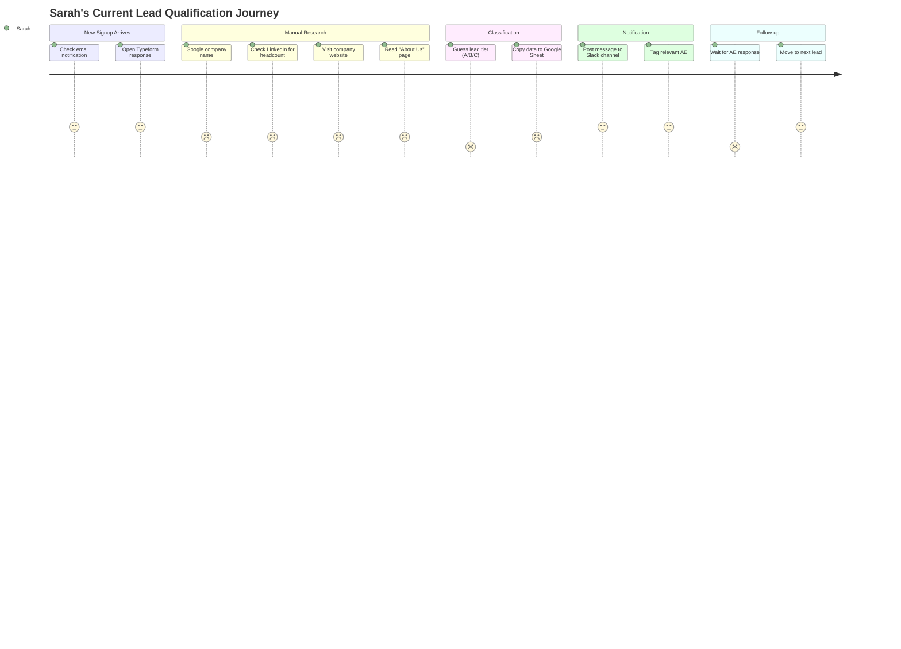

# Design Thinking: Lead Enrichment & Classification Pipeline

[Back to Design Thinking Index](README.md) · [View Technical Blueprint](../workflows/lead_generation.md)

**Stack:** Zapier · OpenAI GPT-4o · Google Sheets · Slack

---

## Phase 1: Empathize 🎯

### 1.1 User Personas

#### Persona A — Sarah, Inside Sales Rep
| Attribute | Detail |
| :--- | :--- |
| **Role** | Inside Sales Development Representative (SDR) |
| **Company Size** | 80-person B2B SaaS startup |
| **Daily Volume** | Receives 30–60 new signups via Typeform per day |
| **Current Process** | Manually Googles each company, checks LinkedIn for employee count, guesses lead tier, and copies data into a Google Sheet before messaging relevant leads on Slack |
| **Time Spent** | ~40 minutes per day on qualification alone |
| **Pain Level** | 🔴 High — "I know Tier A leads are slipping through while I'm Googling small companies" |
| **Tech Comfort** | Moderate — can use Zapier if someone sets it up; cannot write Python |

#### Persona B — Marcus, Sales Operations Manager
| Attribute | Detail |
| :--- | :--- |
| **Role** | Sales Ops & RevOps Lead |
| **Responsibility** | Owns the CRM pipeline, lead routing logic, and reporting dashboards |
| **Core Frustration** | Lead quality data is inconsistent because reps classify leads differently ("Tier A" means different things to different people) |
| **Desired Outcome** | A deterministic, repeatable classification system that every lead passes through before it reaches a human |
| **Tech Comfort** | High — proficient with Zapier, Google Sheets, and basic SQL |

### 1.2 Empathy Map

```
                    ┌──────────────────────────────────────┐
                    │           SARAH (SDR)                │
        ┌───────────┼──────────────────────────────────────┼───────────┐
        │   THINKS  │                                      │   FEELS   │
        │           │  "Am I wasting time on the           │           │
        │  "There   │   wrong leads?"                      │  Anxious  │
        │   must    │                                      │  about    │
        │   be a    │  "The hot leads from yesterday       │  missing  │
        │   faster  │   are already cold"                  │  quota    │
        │   way"    │                                      │           │
        ├───────────┼──────────────────────────────────────┼───────────┤
        │   SAYS    │                                      │   DOES    │
        │           │  "I need better lead intel            │           │
        │  "Can we  │   before I pick up the phone"        │  Googles  │
        │   auto-   │                                      │  each     │
        │   mate    │  "Our CRM data is a mess"            │  company, │
        │   this?"  │                                      │  copies   │
        │           │                                      │  to Sheet │
        └───────────┴──────────────────────────────────────┴───────────┘
```

### 1.3 Current-State Journey Map



**Key Insight:** The two lowest-satisfaction moments (scored 1) are *guessing the lead tier* and *waiting for AE response*. These are the moments where automation has the highest leverage.

### 1.4 Pain-Point Summary

| # | Pain Point | Severity | Frequency | Automatable? |
| :--- | :--- | :---: | :---: | :---: |
| P1 | Manual company research per lead | 🔴 High | Every lead (30–60/day) | ✅ Yes (LLM enrichment) |
| P2 | Inconsistent tier classification across reps | 🔴 High | Every lead | ✅ Yes (deterministic prompt) |
| P3 | Delay between signup and first sales touch | 🟡 Medium | Every lead | ✅ Yes (instant notification) |
| P4 | Personal email leads waste research time | 🟡 Medium | ~30% of leads | ✅ Yes (domain filter) |
| P5 | No single source of truth for lead data | 🟡 Medium | Ongoing | ✅ Yes (Google Sheets log) |

---

## Phase 2: Define 🔍

### 2.1 Problem Statement (Point of View)

> **Sarah**, an inside sales rep who processes 30–60 new signups per day, **needs a way to** instantly receive enriched, consistently-classified lead intelligence in her Slack channel **because** she currently spends 40+ minutes per day on manual research, during which time high-value leads go cold, and her tier classifications are subjective and inconsistent with other reps.

### 2.2 How Might We (HMW) Questions

| # | HMW Question | Priority |
| :--- | :--- | :---: |
| HMW-1 | How might we enrich lead data (industry, size, product) within seconds of a form submission? | 🔴 P0 |
| HMW-2 | How might we apply a deterministic, company-wide lead classification rubric that no human can bypass? | 🔴 P0 |
| HMW-3 | How might we filter out personal-email signups before they consume LLM tokens? | 🟡 P1 |
| HMW-4 | How might we ensure zero lead data loss even if the enrichment API fails? | 🟡 P1 |
| HMW-5 | How might we give Marcus (Sales Ops) a real-time dashboard of lead quality distribution? | 🟢 P2 |

### 2.3 Success Metrics

| Metric | Current Baseline | Target | Measurement Method |
| :--- | :--- | :--- | :--- |
| Time from signup to Slack notification | 10–45 minutes | < 30 seconds | Timestamp diff: Typeform submission → Slack post |
| Classification consistency | Subjective (varies by rep) | 100% deterministic | All classifications generated by same prompt |
| Rep time spent on qualification | ~40 min/day | ~5 min/day (review only) | Self-reported time tracking |
| LLM token waste on junk leads | N/A (no filtering) | < 5% of total calls | Filter hit rate in Zapier logs |
| Lead data completeness rate | ~60% of fields filled | > 95% | Google Sheet audit |

---

## Phase 3: Ideate 💡

### 3.1 Solution Brainstorm

We explored five candidate architectures before converging:

| # | Solution | Pros | Cons | Verdict |
| :--- | :--- | :--- | :--- | :---: |
| S1 | **Zapier + OpenAI inline** (chosen) | Fastest setup, no infra, Slack-native | Per-task cost, limited branching | ✅ Selected |
| S2 | n8n self-hosted + OpenAI | Free hosting, complex logic | Requires Docker/server, higher setup time | ⏸️ V2 |
| S3 | Make.com + OpenAI | Better visual debugging | Webhook latency, steeper learning curve | ❌ |
| S4 | Custom Python script (cron) | Full control, cheapest at scale | No visual monitoring, fragile error handling | ❌ |
| S5 | CrewAI multi-agent approach | Could use researcher + classifier agents | Overkill for a single-step enrichment task | ❌ |

### 3.2 Prioritization Matrix (Impact vs. Effort)

```
    HIGH IMPACT
         │
         │   ┌─────────────┐
         │   │  HMW-1      │    ┌─────────────┐
         │   │  Instant     │    │  HMW-5      │
         │   │  Enrichment  │    │  Dashboard   │
         │   └─────────────┘    └─────────────┘
         │
         │   ┌─────────────┐    ┌─────────────┐
         │   │  HMW-2      │    │  HMW-4      │
         │   │  Deterministic│   │  Retry /    │
         │   │  Classification│  │  Failover   │
         │   └─────────────┘    └─────────────┘
         │
         │   ┌─────────────┐
         │   │  HMW-3      │
         │   │  Email Filter│
         │   └─────────────┘
         │
    LOW IMPACT
         └──────────────────────────────────────
              LOW EFFORT                HIGH EFFORT
```

### 3.3 Workflow Node Design

```mermaid
graph TD
    subgraph "Stage 1: Ingestion"
        A[Typeform Submission] -->|Webhook| B{Filter by Zapier}
        B -->|Personal email| X[🚫 Skip - No LLM call]
        B -->|Business email| C[Continue]
    end

    subgraph "Stage 2: Intelligence"
        C --> D[OpenAI GPT-4o<br/>Enrich + Classify]
        D --> E[Parse JSON Output]
    end

    subgraph "Stage 3: Persistence"
        E --> F[Google Sheets<br/>Append Row]
    end

    subgraph "Stage 4: Notification"
        E --> G{Tier Check}
        G -->|Tier A| H["🔥 Slack #sales-urgent<br/>with @AE mention"]
        G -->|Tier B| I["📊 Slack #sales-leads"]
        G -->|Tier C| J["📝 Slack #sales-low-priority"]
    end

    style X fill:#2d1b1b,stroke:#ef4444
    style H fill:#1b2d1b,stroke:#4ade80
```



---

## Phase 4: Prototype 🔧

### 4.1 Prompt Engineering Lab

The enrichment prompt is the heart of this workflow. We iterated through three versions:

#### Version 1 (Naive — failed)
```text
Tell me about this company: {{company}}
```
**Problem:** Unstructured output. Sometimes returned paragraphs, sometimes lists. Couldn't parse downstream.

#### Version 2 (Structured — partially worked)
```text
Classify this lead as Tier A, B, or C. Company: {{company}}. Return JSON.
```
**Problem:** Inconsistent JSON keys. Sometimes `"tier"`, sometimes `"classification"`.

#### Version 3 (Production — selected)
```text
You are an expert sales operations analyst.
Given the following lead information, enrich the details and classify the lead into:
- Tier A (Enterprise, >500 employees or well-funded tech)
- Tier B (Mid-market, 50-500 employees)
- Tier C (Small business, <50 employees or generic personal emails)

Lead Data:
- Name: {{trigger.name}}
- Email: {{trigger.email}}
- Company: {{trigger.company}}
- Website: {{trigger.website}}

Provide the output strictly in the following JSON format:
{
  "tier": "Tier A/B/C",
  "summary": "Brief summary of what the company does",
  "industry": "Industry category",
  "company_size": "Estimated employee count"
}
```
**Why it works:** Explicit role, explicit rubric, explicit output schema. Zero ambiguity.

### 4.2 Error Handling Design

| Failure Mode | Detection | Recovery Strategy |
| :--- | :--- | :--- |
| OpenAI API timeout (429/500) | Zapier step fails | Autoretry (up to 3x with exponential backoff) |
| Malformed JSON from LLM | JSON parse step fails | Fallback: tag lead as "Review Required" and alert Slack |
| Typeform webhook drops | Missing expected data fields | Zapier filter rejects incomplete payloads before LLM call |
| Google Sheets API quota exceeded | Write step fails | Queue the row and retry on next run |

### 4.3 Data Flow Schema

```
Typeform Payload          OpenAI Response            Google Sheets Row
─────────────────         ──────────────────         ─────────────────────────────
{                         {                          | Timestamp | Name | Email |
  "name": "Jane",          "tier": "Tier A",        | Company | Tier | Summary |
  "email": "jane@acme",    "summary": "Enterprise   | Industry | Size | Source |
  "company": "Acme Inc",     SaaS for logistics",   | ───────────────────────── |
  "website": "acme.com"    "industry": "Logistics",  | 2026-08-05 | Jane |
}                           "company_size": "~2000"  | jane@acme | Acme Inc |
                          }                          | Tier A | Enterprise SaaS |
                                                     | Logistics | ~2000 | Typeform |
```

---

## Phase 5: Test ✅

### 5.1 Test Plan

| Test Case | Input | Expected Output | Pass Criteria |
| :--- | :--- | :--- | :--- |
| TC-1: Enterprise lead | `company: "Snowflake"` | Tier A, summary mentions data cloud | Tier = A, JSON parseable |
| TC-2: Small business lead | `company: "Joe's Pizza"` | Tier C, summary mentions restaurant | Tier = C |
| TC-3: Personal email filter | `email: "john@gmail.com"` | Workflow stops at Filter step | No LLM call made, no Sheets row |
| TC-4: Missing company field | `company: ""` | Filter rejects or LLM returns "Unknown" | No crash, graceful handling |
| TC-5: OpenAI rate limit | Simulate 429 response | Zapier retries 3x | Lead appears in Sheets after retry |
| TC-6: Slack routing by tier | Tier A lead | Posted to `#sales-urgent` with @mention | Correct channel, correct format |
| TC-7: Concurrent volume | 50 leads in 1 minute | All 50 processed, no drops | Sheets has 50 rows, 50 Slack posts |

### 5.2 Acceptance Criteria

- [ ] End-to-end latency (form submit → Slack post) is under 30 seconds for 95th percentile
- [ ] LLM output is valid JSON in 99%+ of calls
- [ ] Personal email addresses never trigger an LLM call
- [ ] Every processed lead has a complete Google Sheets row
- [ ] Tier A leads are visually distinguishable in Slack (emoji, bold, @mention)

### 5.3 Iteration Log

| Iteration | Date | Change | Outcome |
| :--- | :--- | :--- | :--- |
| v0.1 | Week 1 | Basic Typeform → OpenAI → Sheets | JSON parsing failed 15% of time |
| v0.2 | Week 1 | Added strict JSON schema to prompt | Parse failures dropped to <1% |
| v0.3 | Week 2 | Added email domain filter | Reduced LLM calls by 28% |
| v0.4 | Week 2 | Added tier-based Slack routing | Sales team adoption increased |
| v1.0 | Week 3 | Added Autoretry + error Slack alerts | Production-ready release |

---

*[← Back to Design Thinking Index](README.md) · [View Technical Blueprint →](../workflows/lead_generation.md)*
