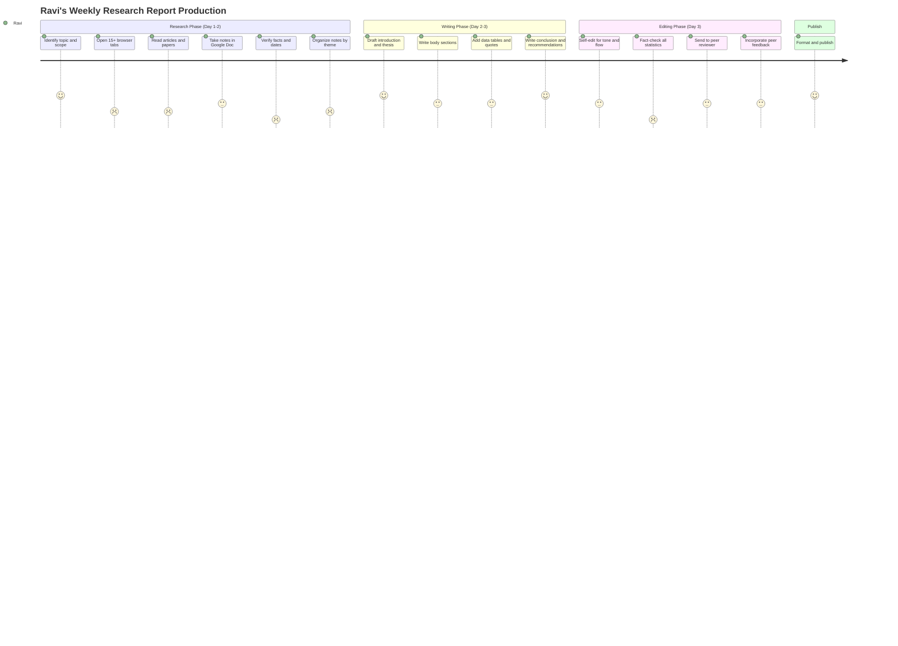

# Design Thinking: Multi-Agent Research & Writing Crew

[Back to Design Thinking Index](README.md) · [View Technical Blueprint](../workflows/multi_agent_research.md)

**Stack:** CrewAI · Serper API · GPT-4o

---

## Phase 1: Empathize 🎯

### 1.1 User Personas

#### Persona A — Ravi, Senior Technology Analyst
| Attribute | Detail |
| :--- | :--- |
| **Role** | Principal Analyst at a consulting firm |
| **Deliverable** | Publishes weekly technical briefings on emerging tech for C-suite clients |
| **Current Process** | (1) Manual web research across 15+ sources, (2) draft in Google Docs, (3) self-edit, (4) send for peer review, (5) final publish |
| **Time per Report** | 2.5–3 full working days |
| **Volume** | 2–3 reports per week |
| **Pain Level** | 🔴 High — "I spend 60% of my time on research gathering. Only 40% on actual analysis and writing." |
| **Quality Bar** | Reports must cite specific numbers, name real companies, and provide actionable recommendations |

#### Persona B — Lisa, Content Marketing Lead
| Attribute | Detail |
| :--- | :--- |
| **Role** | Content Lead at a B2B SaaS company |
| **Need** | Regular thought-leadership blog posts (1,500+ words) on AI, cloud, and automation |
| **Current Process** | Briefs freelance writers → receives drafts in 5–7 days → 2 rounds of edits → publish |
| **Pain Level** | 🟡 Medium — "The freelancer turnaround is too slow. By the time we publish, the news is stale." |
| **Quality Bar** | Needs original analysis, not just reworded press releases |

### 1.2 Current-State Journey Map



**Key Insight:** The two lowest-satisfaction activities (scored 1) are *fact verification* and *organizing raw notes into themes*. These are the highest-value targets for agent delegation.

### 1.3 Pain-Point Summary

| # | Pain Point | Severity | Automatable? |
| :--- | :--- | :---: | :---: |
| P1 | 60% of time spent gathering raw information | 🔴 High | ✅ Researcher agent + Serper API |
| P2 | Manual organization of notes into coherent structure | 🟡 Medium | ✅ Writer agent with structured output |
| P3 | Fact-checking specific numbers, dates, companies | 🔴 High | ⚠️ Partially (agent can cite sources; human must verify) |
| P4 | Tone inconsistency between sections | 🟡 Medium | ✅ Editor agent with style rules |
| P5 | Freelancer turnaround too slow for timely content | 🟡 Medium | ✅ Entire pipeline runs in < 30 min |

---

## Phase 2: Define 🔍

### 2.1 Problem Statement (Point of View)

> **Ravi**, a technology analyst who produces 2–3 weekly briefings, **needs a way to** compress his 3-day research-to-publication cycle into under 1 hour **because** 60% of his time is consumed by mechanical information gathering and note organization, leaving insufficient time for the high-value analytical work his clients pay for.

### 2.2 How Might We (HMW) Questions

| # | HMW Question | Priority |
| :--- | :--- | :---: |
| HMW-1 | How might we have an AI agent conduct comprehensive web research and produce a structured fact sheet in minutes? | 🔴 P0 |
| HMW-2 | How might we have a second agent transform raw research into a coherent, well-structured article? | 🔴 P0 |
| HMW-3 | How might we have a third agent apply editorial standards (tone, grammar, flow, fact consistency)? | 🟡 P1 |
| HMW-4 | How might we ensure the final output cites real sources and doesn't fabricate statistics? | 🔴 P0 |
| HMW-5 | How might we let Ravi customize the "voice" and style of the output to match his brand? | 🟢 P2 |

### 2.3 Success Metrics

| Metric | Current Baseline | Target | Measurement |
| :--- | :--- | :--- | :--- |
| Total production time (research → final draft) | 2.5–3 days | < 30 minutes for first draft | Wall-clock time |
| Human editing time post-AI | N/A | < 60 minutes | Self-reported |
| Source citation accuracy | Manual verification | > 90% of cited facts traceable to real sources | Spot-check audit |
| Content length and depth | 1,500–2,500 words | > 600 words (configurable) | Word count |
| Ravi's satisfaction with draft quality | N/A | > 7/10 on first draft | Subjective review score |

---

## Phase 3: Ideate 💡

### 3.1 Agent Team Design

The fundamental question: **How many agents, and what are their roles?**

We explored several team compositions:

| Team Design | Agents | Process | Verdict |
| :--- | :--- | :--- | :---: |
| **Solo agent** | 1 general-purpose agent | Single prompt does everything | ❌ Output quality too low; jack-of-all-trades |
| **Duo** (Researcher + Writer) | 2 agents | Sequential | ⚠️ Acceptable but no quality gate |
| **Trio** (Researcher + Writer + Editor) | 3 agents | Sequential | ✅ **Selected** — mirrors real publishing team |
| **Squad** (4+ agents) | Researcher, Writer, Fact-Checker, Editor | Hierarchical | ❌ Overkill for this use case; slower |

### 3.2 Agent Role Design (Card Format)

```
┌──────────────────────────────────────────────────────────────┐
│  🔍 AGENT 1: RESEARCH LEAD                                  │
├──────────────────────────────────────────────────────────────┤
│  Role:       Senior Research Analyst                         │
│  Goal:       Find 3–5 verified, current facts on {topic}     │
│  Tools:      SerperDevTool (web search)                      │
│  Backstory:  "You are an elite researcher specialized in     │
│              tech breakthroughs. You find verified sources    │
│              and facts. You always cite URLs."               │
│  Delegation: Not allowed (searches independently)            │
│  Output:     Bulleted summary with links and dates           │
└──────────────────────────────────────────────────────────────┘

┌──────────────────────────────────────────────────────────────┐
│  ✍️ AGENT 2: TECHNICAL CONTENT ARCHITECT                     │
├──────────────────────────────────────────────────────────────┤
│  Role:       Lead Technical Writer                           │
│  Goal:       Create a structured, engaging article           │
│  Tools:      None (uses research from Agent 1)               │
│  Backstory:  "You explain complex topics clearly. You        │
│              structure content with H2s, bold, code blocks." │
│  Delegation: Can delegate back to Researcher if missing data │
│  Output:     600+ word markdown article                      │
└──────────────────────────────────────────────────────────────┘

┌──────────────────────────────────────────────────────────────┐
│  📝 AGENT 3: MANAGING EDITOR                                 │
├──────────────────────────────────────────────────────────────┤
│  Role:       Editor-in-Chief                                 │
│  Goal:       Polish the article to publication quality        │
│  Tools:      None                                            │
│  Backstory:  "You check grammar, spelling, flow, and verify  │
│              that every fact from the research appears        │
│              in the article. You enforce consistency."        │
│  Delegation: Not allowed (final quality gate)                │
│  Output:     Publication-ready markdown saved to file         │
└──────────────────────────────────────────────────────────────┘
```

### 3.3 Process Flow Design

```mermaid
graph TD
    subgraph "Phase 1: Research"
        U[User: Topic Input] --> R[Researcher Agent]
        R --> S[Serper API: Web Search]
        S --> RF[Research Findings<br/>Bulleted list with URLs]
    end

    subgraph "Phase 2: Writing"
        RF --> W[Writer Agent]
        W --> D[Draft Article<br/>600+ words, markdown]
        W -.->|Missing data?<br/>Delegation| R
    end

    subgraph "Phase 3: Editing"
        D --> E[Editor Agent]
        E --> QC{All researcher<br/>facts included?}
        QC -->|No| E2[Flag missing facts]
        QC -->|Yes| F[Final Article<br/>Saved to file]
    end

    subgraph "Phase 4: Human Review"
        F --> H[Ravi Reviews]
        H --> PUB[Publish / Iterate]
    end

    style R fill:#1e293b,stroke:#06b6d4
    style W fill:#1e293b,stroke:#8b5cf6
    style E fill:#1e293b,stroke:#ec4899
```



### 3.4 Hallucination Mitigation Strategy

| Strategy | Implementation | Expected Impact |
| :--- | :--- | :--- |
| **Source-grounded research** | Researcher agent uses real web search (Serper), not LLM memory | Ensures facts are current and real |
| **Citation requirement** | Researcher's `expected_output` requires "URLs and dates" | Writer has traceable sources |
| **Cross-check rule** | Editor's backstory: "verify every fact from the research appears in the article" | Catches writer fabrications |
| **Temperature control** | `temperature=0.2` for all agents | Reduces creative hallucination |
| **Human final review** | Ravi reviews before publishing | Catches any remaining errors |

---

## Phase 4: Prototype 🔧

### 4.1 Task Design Iterations

#### Iteration 1: Vague Task Descriptions (Failed)
```python
Task(description="Research AI agents", agent=researcher)
```
**Problem:** Agent returned surface-level Wikipedia-style summaries.

#### Iteration 2: Specific but Inflexible
```python
Task(description="Find the top 5 AI agent frameworks released in 2026", agent=researcher)
```
**Problem:** Too narrow. Missed important context like funding rounds, partnerships.

#### Iteration 3: Balanced Scope (Production)
```python
Task(
    description="Research the latest 3-5 major updates regarding {topic} in the past year. "
                "Include specific company names, version numbers, funding amounts, and dates. "
                "Cite the URL for each fact.",
    expected_output="A bulleted summary sheet containing specific numbers, names, dates, "
                    "and URLs. Minimum 10 bullet points.",
    agent=researcher
)
```
**Why it works:** Scope is bounded ("3-5 major updates") but output format is rich ("specific numbers, URLs").

### 4.2 Memory Configuration

CrewAI supports three memory types. Our design uses all three:

| Memory Type | Purpose in This Workflow | Configuration |
| :--- | :--- | :--- |
| **Short-term** | Agents share context within a single run (e.g., Writer sees Researcher output) | Enabled by default in sequential process |
| **Long-term** | Store past research runs so future queries can reference historical context | `memory=True` on Crew, stores to SQLite |
| **Entity** | Track key entities (company names, frameworks) across runs | `embedder` configured with OpenAI embeddings |

```python
crew = Crew(
    agents=[researcher, writer, editor],
    tasks=[task_research, task_write, task_edit],
    process=Process.sequential,
    memory=True,
    embedder={
        "provider": "openai",
        "config": {"model": "text-embedding-3-small"}
    }
)
```

### 4.3 Output Quality Checklist

Before accepting the AI-generated report, Ravi checks:

- [ ] All facts trace back to a real, accessible URL
- [ ] Company names, dates, and numbers match the Researcher's raw findings
- [ ] Article has a clear thesis statement in the introduction
- [ ] Each section uses at least one specific example
- [ ] Conclusion contains actionable recommendations (not just summary)
- [ ] Tone is analytical, not promotional
- [ ] No first-person voice unless style guide allows it
- [ ] Word count meets minimum (600+)

---

## Phase 5: Test ✅

### 5.1 Test Plan

| Test Case | Topic Input | Expected Behavior | Pass Criteria |
| :--- | :--- | :--- | :--- |
| TC-1: Current topic | "Agentic AI frameworks in 2026" | Rich research, structured article, polished output | > 600 words, > 5 cited facts |
| TC-2: Niche topic | "Post-quantum cryptography NIST standards" | Narrower but still structured | Relevant facts, no hallucinated standards |
| TC-3: Broad topic | "The future of AI" | Writer should narrow scope creatively | Coherent article, not a brain dump |
| TC-4: Delegation test | Writer asks for missing data | Writer delegates back to Researcher | Delegation happens, data is retrieved |
| TC-5: Editor catches error | Writer omits a Researcher fact | Editor flags the omission | Flag present in editor's output |
| TC-6: Token efficiency | Standard 3-agent run | Total tokens < 50K | OpenAI usage dashboard |
| TC-7: File output | Any topic | `final_research_report.md` created | File exists, contains markdown |

### 5.2 Quality Scoring Rubric

Each generated report is scored by the human reviewer on 5 dimensions:

| Dimension | Weight | Score Range | Description |
| :--- | :---: | :---: | :--- |
| **Factual Accuracy** | 30% | 1–10 | Are all stated facts verifiable? |
| **Source Quality** | 20% | 1–10 | Are sources reputable and current? |
| **Structure & Flow** | 20% | 1–10 | Is the article logically organized? |
| **Depth of Analysis** | 20% | 1–10 | Does it go beyond surface-level reporting? |
| **Grammar & Polish** | 10% | 1–10 | Is the language professional and error-free? |

**Target:** Weighted score > 7.0 / 10 on first AI draft (before human editing).

### 5.3 Iteration Log

| Iteration | Change | Outcome |
| :--- | :--- | :--- |
| v0.1 | Single agent, no tools | Hallucinated 40% of facts |
| v0.2 | Added Serper search tool to Researcher | Facts became verifiable |
| v0.3 | Split into Researcher + Writer (2 agents) | Structure improved dramatically |
| v0.4 | Added Editor (3 agents) | Grammar and consistency improved |
| v0.5 | Added `expected_output` constraints | Output format became predictable |
| v0.6 | Lowered temperature to 0.2 | Reduced creative hallucinations |
| v1.0 | Enabled long-term memory | Subsequent runs reference prior research |

---

*[← Back to Design Thinking Index](README.md) · [View Technical Blueprint →](../workflows/multi_agent_research.md)*
