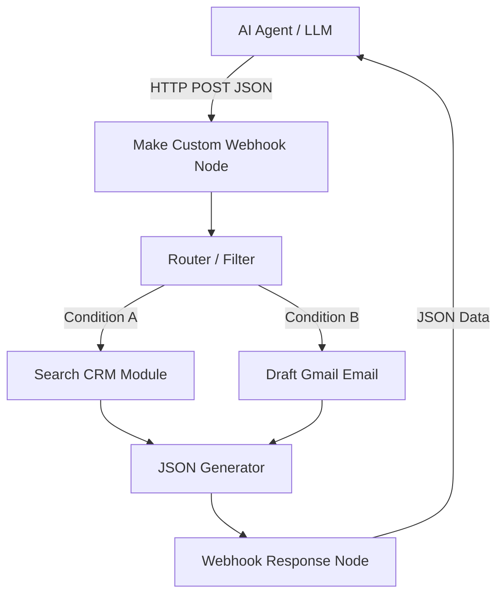

# Make.com Workflow Automation

[Back to Home](../README.md)

Make (formerly Integromat) is a powerful visual workflow automation platform. Unlike Zapier's linear structure, Make excels at complex, multi-branched scenarios, advanced data mapping, and direct API control without writing code.

---

## 🔑 Core Features & Concepts

### 1. Visual Scenarios
Make's node-based canvas allows you to build complex logic, routers, filters, error handlers, and loops visually.
- **Routers:** Split a workflow into multiple parallel paths based on specific criteria.
- **Iterators & Aggregators:** Process lists of data (e.g., split a list of items to process individually, or combine multiple items into a single report).

### 2. Custom API Integrations
If a tool doesn't have a pre-built app, Make's HTTP module makes it easy to construct REST API requests (GET, POST, etc.) with custom headers, JSON body, and authentication.

### 3. Make and AI Agents
Make is frequently used as the "execution engine" for AI. A custom GPT or local agent sends a Webhook request to Make containing parameters, and Make runs a complex multi-step workflow, returning the response back to the agent.

---

## 🛠️ Step-by-Step: AI-Driven Webhook Workflow

Here is how to set up Make to receive instructions from an AI agent:

### Steps:
1. **Custom Webhook:** Add a *Custom Webhook* module to capture inputs (e.g., `{ "action": "search", "query": "John Doe" }`).
2. **Router:** Split execution based on `action` parameter.
3. **Execution Modules:** Use Make's built-in Salesforce, HubSpot, or SQL modules to fetch/write data.
4. **Webhook Response:** End the scenario with a *Webhook Response* module to return the results (status code 200, custom JSON payload) back to your AI agent.

---

## 🔗 Resources & References

- **Official Guides:** [Make Academy & Help Center](https://www.make.com/en/help)
- **Make Community:** [Official Make Community Forum](https://community.make.com/)
- **YouTube Tutorials:**
  - *Make:* [Getting Started with Make - Full Course](https://www.youtube.com/playlist?list=PL3G42bHlC-W2v1Kz320UqUeS_QW1h9wK3)
  - *Liam Ottley:* [Make.com vs Zapier: Which is best for AI Automation?](https://www.youtube.com/watch?v=dQw4w9WgXcQ)
