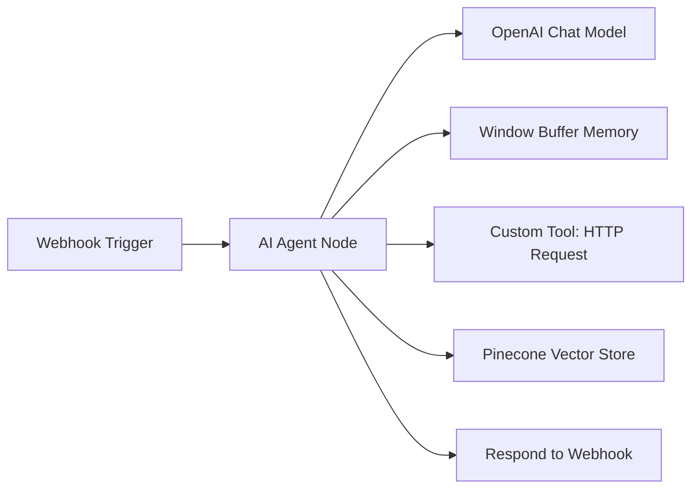

# n8n Workflow Automation with Native AI Nodes

[Back to Home](../README.md)

n8n is a fair-code, self-hostable workflow automation tool. It has emerged as the premier hybrid platform for building AI workflows due to its native **Advanced AI Nodes** which allow you to embed LLMs, memory, vector databases, and tools directly into visual flow graphs.

---

## 🔑 Core Features & Concepts

### 1. Self-Hostable & Privacy Centric
Unlike cloud-only platforms, you can host n8n on Docker or your local machine for free. This is essential for companies dealing with sensitive customer data.

### 2. Native AI/LangChain Nodes
n8n integrates LangChain components natively under the hood. You can drag and drop:
- **AI Agent Node:** An agent that reasons on tasks, calls custom tools, and keeps conversation memory.
- **LLM Chain Node:** For basic prompt pipelines.
- **Vector Database Connectors:** Pinecone, Qdrant, Milvus, Supabase.
- **Memory Nodes:** Buffer memory, Redis chat memory, Window buffer memory.
- **Document Loaders & Text Splitters:** For RAG pipelines.

### 3. JavaScript / Python Code Blocks
If you need custom data transformation, you can insert a *Code Node* to run raw JavaScript or Python on the incoming JSON payloads, giving you complete flexibility.

---

## 🛠️ Step-by-Step: Self-Hosting & Running n8n

### Running Locally with Docker

```bash
docker run -it --rm --name n8n -p 5678:5678 -v ~/.n8n:/home/node/.n8n n8nio/n8n
```

Once running, access the dashboard at `http://localhost:5678`.

---

## 💡 Visualizing an n8n AI Agent Workflow



### Configuration Tips:
- **System Message:** Instruct your n8n AI Agent Node: `"You are a technical support agent. Use the Pinecone Vector Store tool to look up technical articles before replying."`
- **Output:** The agent automatically coordinates LLM responses and tool execution, returning the final text directly.

---

## 🔗 Resources & References

- **Official Website:** [n8n.io](https://n8n.io/)
- **GitHub Repository:** [n8n-io/n8n](https://github.com/n8n-io/n8n)
- **YouTube Tutorials:**
  - *n8n Official:* [Building AI Agents in n8n - Step by Step](https://www.youtube.com/@n8n-io)
  - *Prompt Engineering:* [Self-Hosting n8n & Building your first local RAG Pipeline](https://www.youtube.com/watch?v=dQw4w9WgXcQ)
