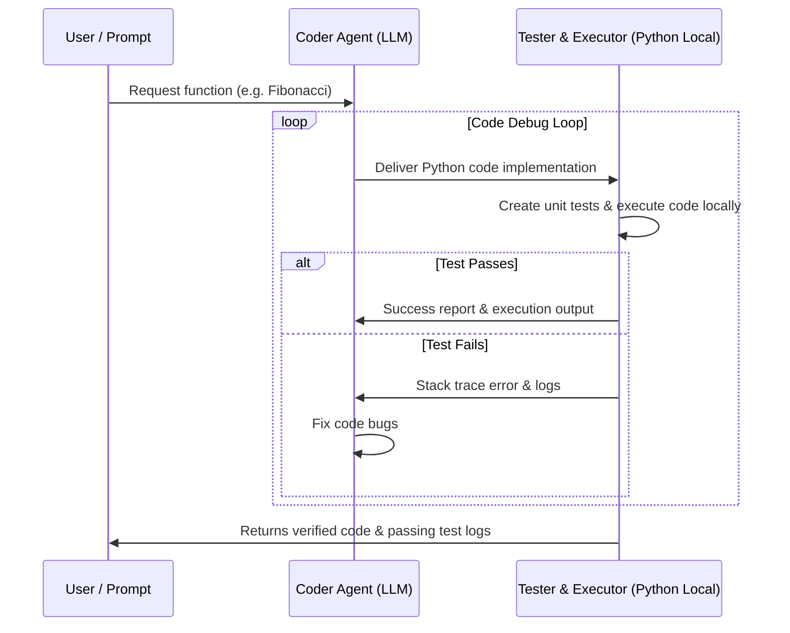

# Automated Testing Code Assistant (AutoGen)

[Back to Home](../README.md)

This workflow outlines how to set up an AutoGen conversation loop. It consists of a coder agent writing Python functions, and an executor agent writing unit tests and executing the code locally, iterating until the tests pass.

---

## 🏗️ Architecture Diagram



---

## 🛠️ Step-by-Step Configuration in Python

### 1. Requirements Installation
```bash
pip install pyautogen
```

### 2. Implementation Code (`autogen_coder.py`)

```python
import autogen

# LLM Configuration
config_list = [
    {
        "model": "gpt-4o",
        "api_key": "your-openai-api-key"
    }
]

llm_config = {
    "config_list": config_list,
    "temperature": 0
}

# --- Agents Definition ---

# The AssistantAgent writes the code
coder = autogen.AssistantAgent(
    name="CoderAgent",
    llm_config=llm_config,
    system_message="""You are an expert Python coder. 
    Write clean, documented Python code. When asked to write a function, output the code block.
    If the ExecutorAgent reports an error, analyze the stack trace and output a corrected code block."""
)

# The UserProxyAgent executes the code locally
executor = autogen.UserProxyAgent(
    name="ExecutorAgent",
    human_input_mode="NEVER",
    max_consecutive_auto_reply=10,
    is_termination_msg=lambda x: x.get("content", "").rstrip().endswith("TERMINATE"),
    code_execution_config={
        "work_dir": "coding_workspace",
        "use_docker": False # Set to True in production for safety!
    },
    system_message="""You execute the code blocks written by the CoderAgent.
    Once the code is provided, write a comprehensive unit test suite, execute it, and report the results.
    If tests pass, write 'TERMINATE' at the end of the message."""
)

# --- Start Conversation ---

executor.initiate_chat(
    coder,
    message="""Write a Python function named `parse_and_validate_json` that takes a JSON string 
    and checks if it contains the keys: 'user_id', 'email', and 'roles'. 
    If a key is missing, raise a custom KeyError. Ensure email is validated using regex. Write tests for this."""
)
```

---

## 💡 Pro-Tips for Production
- **Docker Sandbox:** Always set `"use_docker": True` (default in AutoGen) when executing code written by an LLM to prevent unauthorized commands from running on your host machine.
- **State Management:** Use AutoGen's `GroupChat` to scale this workflow to multiple agents (e.g. Coder, Code Reviewer, Tester, Deployer).
