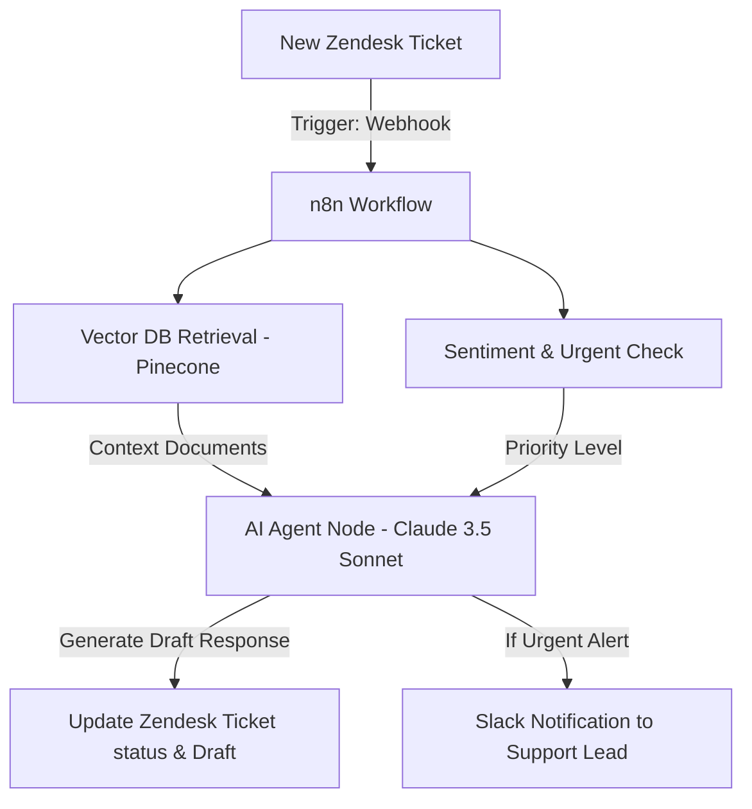

# Intelligent Customer Support Router & Triage

[Back to Home](../README.md)

This workflow details how to build an automated customer support triaging agent. The agent reads incoming Zendesk tickets, searches a vector database for relevant troubleshooting documentation, drafts a reply, and routes the ticket to the correct department.

---

## 🏗️ Architecture Diagram



---

## 🛠️ Step-by-Step Configuration

### 1. Zendesk Trigger (Webhook)
- **Node:** Zendesk Trigger (or Webhook node).
- **Event:** On ticket creation. Exposes variables like ticket subject, body, and customer ID.

### 2. Pinecone Vector Search
- **Node:** Pinecone Node (Retrieve Documents).
- **Search Query:** Ticket Body.
- **Embedding Model:** OpenAI Text-Embedding-3-Small.
- **Objective:** Fetch the top 3 most relevant documentation sheets or past resolved support transcripts.

### 3. Claude 3.5 Sonnet Agent
- **Node:** AI Agent Node in n8n.
- **Model:** Anthropic Chat Model (Claude 3.5 Sonnet).
- **System Instructions:**
  ```text
  You are an expert customer support agent.
  Analyze the incoming support ticket. Use the retrieved Pinecone documentation to construct a accurate and helpful answer.
  
  Format your final output as a JSON:
  {
    "suggested_reply": "Dear Customer...",
    "category": "Billing/Technical/Feature Request",
    "urgency": "High/Medium/Low"
  }
  ```

### 4. Zendesk Triage Update
- **Node:** Zendesk Node.
- **Action:** Update Ticket.
- **Properties:**
  - **Status:** Open (or Pending).
  - **Internal Note:** `AI Classification: Category: {{ai_agent.category}} | Urgency: {{ai_agent.urgency}}`
  - **Public Draft Reply:** `{{ai_agent.suggested_reply}}` (to be reviewed by a human agent before sending).

---

## 💡 Pro-Tips for Production
- **Human-in-the-loop (HITL):** Do not send AI responses directly to customers. Have n8n create a "draft response" inside Zendesk, letting human agents verify it with a single click.
- **Feedback Loop:** If a human edits the draft response significantly, save the edited response back to the vector database to improve future answers.
