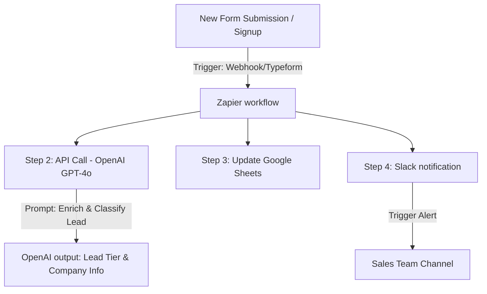

# Lead Enrichment & Classification Workflow

[Back to Home](../README.md)

This workflow outlines how to automate lead capturing, data enrichment (using OpenAI), lead tiering (classification), and team notification.

---

## 🏗️ Architecture Diagram



---

## 🛠️ Step-by-Step Configuration

### Step 1: The Trigger (Typeform or Custom Webhook)
- **App:** Webhooks by Zapier or Typeform.
- **Event:** *Catch Hook* (retrieve signup data including name, email, company, and website).

### Step 2: The enrichment (OpenAI GPT-4o)
- **App:** OpenAI by Zapier (or generic HTTP POST module).
- **Event:** *Send Prompt*.
- **Prompt Configuration:**
  ```text
  You are an expert sales operations analyst. 
  Given the following lead information, enrich the details (find domain size, industry, and main product) and classify the lead into:
  - Tier A (Enterprise, >500 employees or well-funded tech)
  - Tier B (Mid-market, 50-500 employees)
  - Tier C (Small business, <50 employees or generic personal emails)

  Lead Data:
  - Name: {{trigger.name}}
  - Email: {{trigger.email}}
  - Company: {{trigger.company}}
  - Website: {{trigger.website}}

  Provide the output strictly in the following JSON format:
  {
    "tier": "Tier A/B/C",
    "summary": "Brief summary of what the company does",
    "industry": "Industry category",
    "company_size": "Estimated employee count"
  }
  ```

### Step 3: Google Sheets Log
- **App:** Google Sheets.
- **Action:** *Create Spreadsheet Row*.
- **Data mapped:** Name, Email, Company, Tier (from OpenAI JSON output), Summary (from OpenAI).

### Step 4: Sales Alert (Slack)
- **App:** Slack.
- **Action:** *Send Channel Message*.
- **Channel:** `#sales-leads`.
- **Formatting:**
  ```text
  🔥 *New Lead Captured!*
  👤 *Name:* {{trigger.name}}
  🏢 *Company:* {{trigger.company}}
  📊 *Lead Tier:* {{openai.tier}}
  💡 *About:* {{openai.summary}}
  ```

---

## 💡 Pro-Tips for Production
- **Email Filtering:** Add a *Filter by Zapier* step before OpenAI to check if the email is a business email (exclude `@gmail.com`, `@yahoo.com`) to save LLM tokens.
- **Error Handling:** If OpenAI times out, use Zapier's *Autoretry* function to prevent lead loss.
