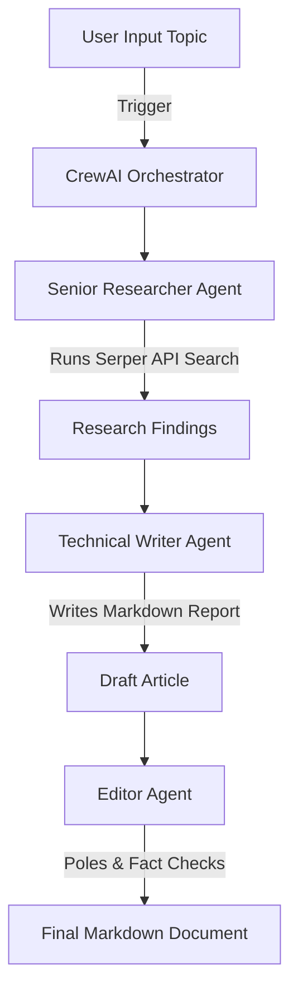

# Multi-Agent Research & Writing Crew

[Back to Home](../README.md)

This workflow outlines how to set up a multi-agent system using CrewAI. The team consists of three specialized agents working sequentially to conduct research on a technical topic, outline a detailed report, and edit the final output.

---

## 🏗️ Architecture Diagram



---

## 🛠️ Step-by-Step Python Script Setup

### 1. Requirements Installation
```bash
pip install crewai crewai-tools langchain-openai
```

### 2. Implementation Code (`crew_research.py`)

```python
import os
from crewai import Agent, Task, Crew, Process
from crewai_tools import SerperDevTool
from langchain_openai import ChatOpenAI

# Set credentials
os.environ["OPENAI_API_KEY"] = "sk-..."
os.environ["SERPER_API_KEY"] = "your-serper-key"

search_tool = SerperDevTool()
llm = ChatOpenAI(model="gpt-4o", temperature=0.2)

# --- Agents Definition ---

researcher = Agent(
    role="Research Lead",
    goal="Search the web and extract current technical facts on {topic}.",
    backstory="You are an elite researcher specialized in tech breakthroughs. You find verified sources and facts.",
    tools=[search_tool],
    llm=llm,
    verbose=True
)

writer = Agent(
    role="Technical Content Architect",
    goal="Create a structured, engaging blog article about {topic}.",
    backstory="You are a writer known for explaining complex topics clearly. You structure content with headers and code blocks.",
    llm=llm,
    verbose=True
)

editor = Agent(
    role="Managing Editor",
    goal="Proofread and polish the article on {topic} for publication.",
    backstory="You check for spelling, grammar, flow, and verify that the writer included all researcher facts.",
    llm=llm,
    verbose=True
)

# --- Tasks Definition ---

task_research = Task(
    description="Research the latest 3-5 major updates regarding {topic} in the past year.",
    expected_output="A bulleted summary sheet containing specific numbers, names, and links.",
    agent=researcher
)

task_write = Task(
    description="Using the summary sheet, write an article explaining {topic}. Use headings, lists, and bold text.",
    expected_output="A drafted article in markdown format with at least 600 words.",
    agent=writer
)

task_edit = Task(
    description="Edit the drafted markdown article. Ensure a professional tone and check for factual consistency.",
    expected_output="A publication-ready markdown article.",
    agent=editor,
    output_file="final_research_report.md"
)

# --- Kickoff Crew ---

crew = Crew(
    agents=[researcher, writer, editor],
    tasks=[task_research, task_write, task_edit],
    process=Process.sequential
)

result = crew.kickoff(inputs={"topic": "Agentic AI orchestration frameworks in 2026"})
print("Research completed successfully! Saved to final_research_report.md")
```

---

## 💡 Pro-Tips for Production
- **Hierarchical Processes:** For complex topics, set `process=Process.hierarchical` and define a `manager_llm`. The manager agent will assign sub-tasks automatically.
- **Custom Tools:** You can build custom CrewAI tools to query your company databases or query internal APIs.
